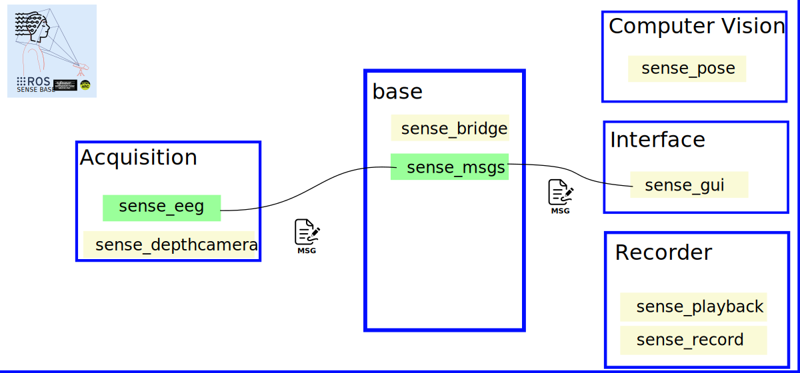

# :brain: SENSE-BASE: An Open-Source Framework for Biological Signals and Computer Vision Sensor Data
**SENSE-BASE** is a ROS2-based framework for multimodal biosignals from EEG, EoG, ECG, and depth cameras.

**Diagram**. Frawework illustrates the main blocks for acquisition, base, computer vision, interface, and recorder, along with their corresponding ROS 2 packages. Highlight the green blocks as already implemented and the yellow ones as in progress.

## 1. :robot: SENSE-BASE ROS2-based packages
* [sense_base](https://github.com/sense-base/base) Main repo to manage packages.
* [sense_eeg](https://github.com/sense-base/sense_eeg) Mock EEG publisher
* [sense_msgs](https://github.com/sense-base/sense_msgs) ROS2 messages 
* [sense_bridge](https://github.com/sense-base/sense_bridge) Manage multi-dimensional arrays
* [sense_pose](https://github.com/sense-base/sense_pose) Pose estimation tools


## 2. :school_satchel: Getting started
* :octocat: Clone base repositories under `sense-base` path.
We suggest cloning repos under sense-base path as for example `base`, `sense_eeg` and `sense_msgs`.
```
mkdir sense-base && cd sense-base
git clone git@github.com:sense-base/base.git
git clone git@github.com:sense-base/sense_eeg.git
git clone git@github.com:sense-base/sense_msgs.git
```
* :computer: [Setting up ROS2 with docker container](https://github.com/sense-base/base/tree/main/docs/docker)
* Refer to the [CONTRIBUTING](https://github.com/sense-base/base/blob/main/CONTRIBUTING.md) guideline for detailed instructions on contributing to the project.

## 3. :nut_and_bolt: Run and debug packages

### Setup environment with pyenv
Install Python Environment (3.10 or higher recommended):

#### Using uv
```
uv venv --python 3.10.17
source .venv/bin/activate
uv pip install -e ".[dev]"
uv pip list --verbose
```

#### Using pyenv
```bash
pyenv install 3.10.17  
```

```bash
pyenv virtualenv 3.10.17 sense_EEG-env
pyenv local sense_EEG-env
pip install -e ".[dev]"
```

#### Run Pre-commit Hooks
```bash
pre-commit run --all-files
```

* :nut_and_bolt: Run and debug. Open a terminal into the loaded container in VSCode using the dev containers extension, and run
```
colcon build --symlink-install
source install/setup.bash
ros2 launch eeg_publisher mock_publisher_launch.py
```

On a different terminal, run
```
source install/setup.bash
ros2 topic list
ros2 topic echo /eeg/raw
ros2 bag record /eeg/raw
ros2 bag info <bag_file_name> (e.g., `rosbag2_data_time`)
ros2 bag play <bag_file_name>
rqt_graph
```